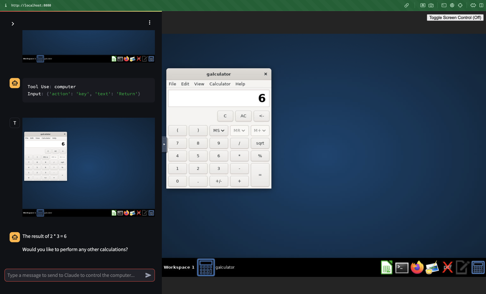
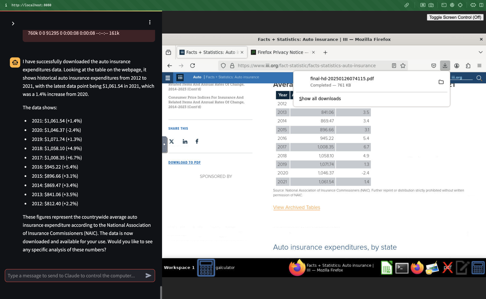
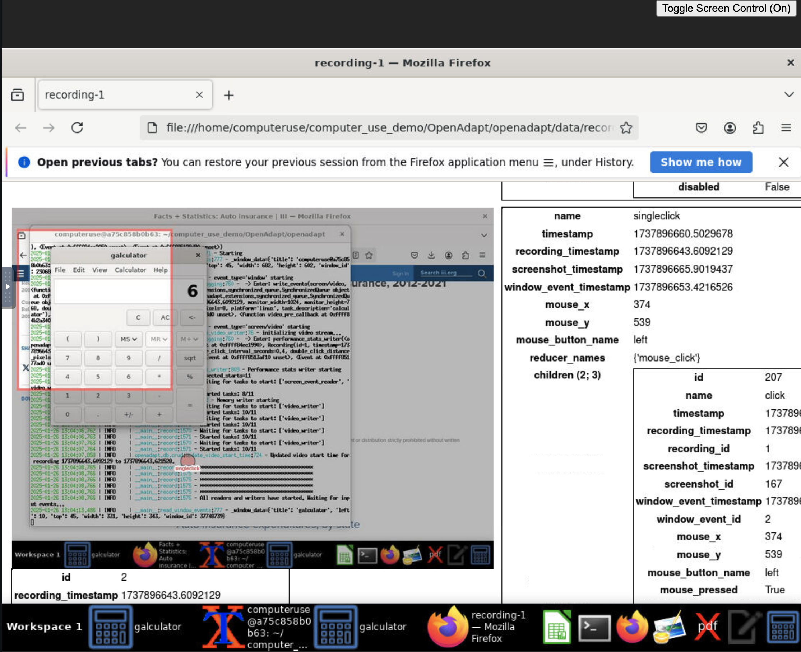
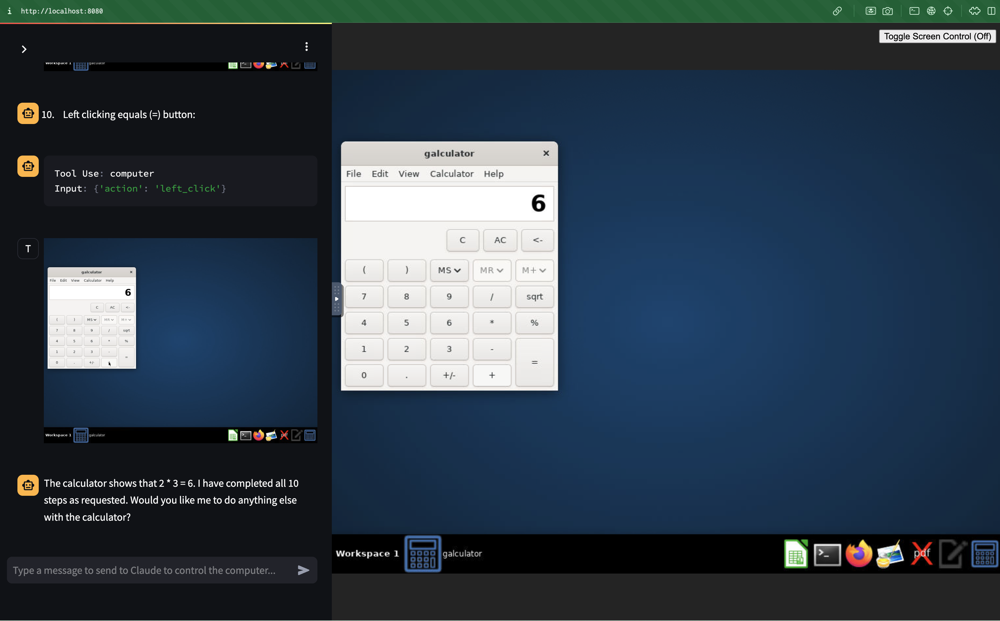

# Automation agent workflows

Examples of automation agent workflows.

# PyAutoGUI
The script `pyauto_example.py` can be used to run automation described by natural language via prompts.

A sample execution is available [here](./outputs/calculator_example_pyautogui.mp4).
It opens the calculator app on the Mac and performs a simple operation.
[](https://youtu.be/-sRKrTocaPU)


# Anthropic Computer use

We leverage [Anthropic Computer use](https://docs.anthropic.com/en/docs/build-with-claude/computer-use) in a few scenarios.

## Calculator example by prompting Claude directly
First, we install the container version in their reference implementation and ask Claude to run the same example of the calculator.



Claude successfully finds and uses the calculator app, as requested.

## Harvest III.org expenditure data by prompting Claude directly

We ask Claude the following:
> Download historical auto insurance expenditures from iii.org

Claude then opens the browser and navigates to the iii.org site and downloads a pdf and extracts relevant information from it.



## Calculator example with OpenAdapt

We leverage OpenAdapt to extract step-by-step information for the calculator example.

Initially, we install OpenAdapt inside the tool use container, where we are running Anthropic Computer use and record the demonstration of using the calculator.



We then write a [script](./get_recording_description.py) to use OpenAdapt API to extract descriptions of each step in the demonstration (logs of execution are available [here](./get_recording_description.log)).

Like this we can prompt Claude with detailed step-by-step instructions:
```
1. Move mouse to the calculator button
2. Left singleclick 'calculator'
3. Move mouse to 'Number 2 button'
4. Left singleclick 'Number 2 button'
5. Move mouse to 'Multiplication (*) button'
6. Left singleclick 'Multiplication symbol (*)'
7. Move mouse to 'Number 3 button'
8. Left singleclick 'Number 3 button'
9. Move mouse to 'Equals button'
10. Left singleclick '= (equals sign button)'
```

You can inspect [the original prompt](./original_prompt.txt), as output by the script, and the [manually edited prompt](edited_prompt.txt).



## Obtain maximum exchange rate with OpenAdapt

In this experiment, we record a demonstration of using the [x-rates website](https://www.x-rates.com/average/) to find the highest monthly average value of the USD/EUR exchange rate from 2022 to Jan 2025.
