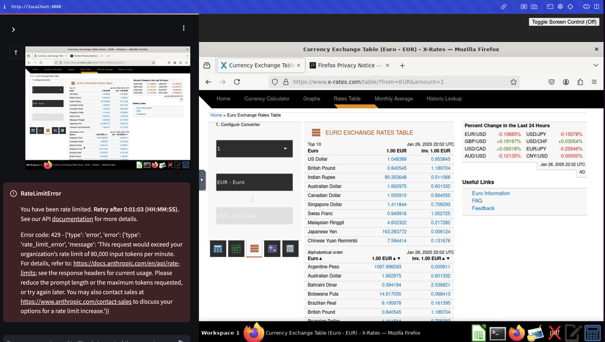

# Automation agent workflows

Examples of automation agent workflows.

## PyAutoGUI
The script `pyauto_example.py` can be used to run automation described by natural language via prompts.

A sample execution is available [here](./outputs/calculator_example_pyautogui.mp4).
It opens the calculator app on the Mac and performs a simple operation.
[](https://www.youtube.com/embed/-sRKrTocaPU)

## Calculator example with Anthropic Computer use

We leverage [Anthropic Computer use](https://docs.anthropic.com/en/docs/build-with-claude/computer-use) in a few scenarios.

First, we install the container version in their reference implementation and ask Claude to run the same example of the calculator.


Claude successfully finds and uses the calculator app, as requested.

## Harvest III.org expenditure data with Anthropic Computer use

We ask Claude the following:
> Download historical auto insurance expenditures from iii.org

Claude then opens the browser and navigates to the iii.org site and downloads a pdf and extracts relevant information from it.


## Calculator example with OpenAdapt

We leverage OpenAdapt to extract step-by-step information for the calculator example.

Initially, we install OpenAdapt inside the tool use container, where we are running Anthropic Computer use and record the demonstration of using the calculator.


We then write a [script](./get_recording_description.py) to use OpenAdapt API to extract descriptions of each step in the demonstration (logs of execution are available [here](./get_recording_description.log)).

Like this we can prompt Claude with detailed step-by-step instructions:
```
1. Move mouse to the calculator button
2. Left singleclick 'calculator'
3. Move mouse to 'Number 2 button'
4. Left singleclick 'Number 2 button'
5. Move mouse to 'Multiplication (*) button'
6. Left singleclick 'Multiplication symbol (*)'
7. Move mouse to 'Number 3 button'
8. Left singleclick 'Number 3 button'
9. Move mouse to 'Equals button'
10. Left singleclick '= (equals sign button)'
```

You can inspect [the original prompt](./prompt_calculator_original.txt), as output by the script, and the [manually edited prompt](./prompt_calculator_edited.txt).


## New use case: Obtain maximum exchange rate in a given time range

We suggest a new, more compelling experiment: to obtain the highest monthly average exchange rate for USD/EUR between 2022 and 2025, by fetching relevant information from the [x-rates website](https://www.x-rates.com/average/).

For that we performa a demonstration and record it with OpenAdapt. A sample recording can be found [here](./outputs/exchange_rate_flow_visualization.pdf).

Next, we planned to get a step-by-step description as done previously, but this failed because the visualization could not be loaded for analysis (refer to "troubleshooting" section below for details).

Thus, we created the step-by-step description manually and sent it to Claude to fetch the relevant values and reveal the maximum value.

Despite multiple attempts, we couldn't get the model to succeed. Next, we analyze the failure patterns.

## Failure patterns in Anthropic computer use

1. In a [first iteration](./prompt_exchange_rate_v1.py), we just asked the model to go page by page collecting values, which resulted in an incorrect, yet confident-sounding result. The system had not seen some values, which were outside of the screenshot, thus prompting the failure.
2. In the [second version](./prompt_exchange_rate_v2.txt), we explicitly asked the model to scroll to the bottom of the page, and the model got into an infinite loop on year 2023, loading it over and over until we got rate-limited.
3. In the [third version](./prompt_exchange_rate_v3.txt), we added a system prompt with generic instructions to scroll down if needed, then omitted explicit scroll down instructions, but the model didn't follow the instruction and could not uncover all values.
4. In the [fourth version](./prompt_exchange_rate_v4.txt), we asked the model to use the page down key as suggested by Anthropic, but the model ignored the instruction.
5. In the [fifth version](./prompt_exchange_rate_v5.txt), we used a high-level instruction to check if the model could create its own low-level plan with success but the model got stuck in a loop and got rate-limited again.



Anthropic has reported the following outstanding issues, which seem to affect this particular scenario:
> Some UI elements (like dropdowns and scrollbars) might be tricky for Claude to manipulate using mouse movements. If you experience this, try prompting the model to use keyboard shortcuts.

> If you repeatedly encounter a clear set of issues or know in advance the tasks Claude will need to complete, use the system prompt to provide Claude with explicit tips or instructions on how to do the tasks successfully.

> Scrolling reliability: Scrolling may be unreliable in the current experience, and the model may not reliably scroll to the bottom of a page. Scrolling-like behavior can be improved via keystrokes (PgUp/PgDown).

We tried system prompt messages, page down indications and step-by-step instructions but the model got into one of the following situations:
* stuck in a loop and unable to proceed (e.g. repeatedly on the same month)
* unable to scroll down the page
* ignores specific instructions around drop-down or scrolling behavior
* sometimes values which are seen are ignored, despite being on the page


## Troubleshooting

We encountered some difficulties with OpenAdapt, namely:
* Visualizing a recording with OpenAdapt takes a long time. It takes many minutes before the visualization can be seen. Sometimes it seems to hang completely and after many minutes the process gets killed.
* Trying to load a recording via `get_latest_recording` can also take a long time and eventually hang.
* Trying to run recordings and visualize them in the host machine (outside of the container) also resulted in the same problems. In any ocassion, I run into incoherent DB state, which forced me to reinstall.


